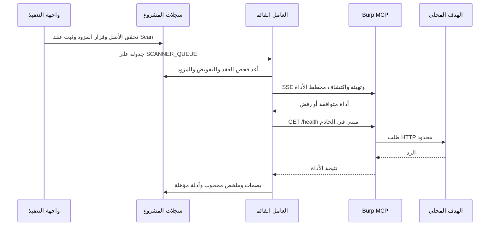

# P2 — نقل Burp ودمجه مع التنفيذ القائم

## الحالة ومعيار الإغلاق

تنفيذ النقل والربط على فرع `codex/burp-mcp-transport-20261003` مبني على P1 عند `88d421529ebf5690a3a4203bf0ade8cc7b54c567`. هذا المستند يشرح التغيير؛ العدد النهائي للاختبارات وحالة التشغيل الحي في `WEB_LABS_CHECKPOINT.md`.

إغلاق P2 يحتاج دليلًا من Burp الرسمي العامل، ثم هدف fixture العامل، بالإضافة إلى اختبارات العقد. اختبارات الخادم التجريبي لا تستبدل ذلك. تسجيل capability لا يجعل solver جاهزًا، ولا يعني تجهيز runtime مستقل أنه دخل صورة العامل الإنتاجية.

## لماذا تغير الربط

البوابة السابقة ترسل JSON-RPC POST واحدًا إلى مزود معتمد. إضافة PortSwigger الرسمية تستعمل MCP SSE: يفتح العميل stream، يقرأ عنوان استقبال الرسائل ضمن نفس origin، يهيئ الجلسة، يعلن انتهاء التهيئة، يكتشف الأدوات ثم يستدعي الأداة المختارة.

ثبتنا مراجعة المصدر الرسمي `PortSwigger/mcp-server@642e6fa31c63db3886a353fcd7ed62037e0ceed5`. أداة HTTP/1 هي `send_http1_request` ومدخلاتها `content`, `targetHostname`, `targetPort`, `usesHttps`. النقل القديم يبقى متاحًا لمزودي المشروع السابقين؛ لا نعامل أسماء أدواتهم كمرادفات مثبتة لأدوات PortSwigger.

المراجع الأولية: [المصدر المثبت](https://github.com/PortSwigger/mcp-server/tree/642e6fa31c63db3886a353fcd7ed62037e0ceed5)، [BApp الرسمي](https://portswigger.net/bappstore/9952290f04ed4f628e624d0aa9dccebc)، [إصدار Burp 2026.9](https://portswigger.net/burp/releases/professional-community-2026-9)، [تشغيل JAR](https://portswigger.net/burp/documentation/desktop/troubleshooting/launch-from-command-line).

**تمييز النسخ:** إصدار BApp المعلن 1.3.0. مصدر `KtorServerManager.kt` المثبت يعلن `serverInfo` باسم `burp-suite` ونسخة `1.1.2`. لذلك `server_reported_version` لا يساوي إصدار BApp أو إصدار Burp Desktop. `edition=not_reported` لأن MCP لا يعلن Community/Professional؛ نسجل اختيار النسخة من التشغيل الفعلي منفصلًا.

## خريطة التنفيذ والخرج

كل مسارات الخدمات التالية تحت `aegis-platform/backend/fastapi_app/`.

| المكان | الاندماج | النتيجة |
|---|---|---|
| `services/burp_mcp_transport.py` | HTTPX async داخل wrapper متزامن لعامل Celery | دورة SSE كاملة، discovery ومخطط مثبت، بصمات وسبب فشل محدود |
| `services/burp_http_probe.py` | منشئ طلب تستخدمه البوابة وCLI | GET `/health` مجهول الهوية مبني من origin الأصل؛ ملخص محجوب |
| `services/burp_mcp_gateway.py` | ProviderApprovalDecision وBurpMCPSession/Invocation والأدلة القائمة | عملية `burp.http_request` محدودة؛ حجب النص الخام وإبقاء البصمات والتأهيل |
| `services/burp_mcp_capability.py` و`burp_mcp_execution.py` | خيارات capability وقرار مزود المشروع الحالي | اختيار مرجع UUID معتمد دون قبول endpoint من العميل |
| `services/capability_registry.py` و`kali_profile_policy.py` | سجل القدرات وprofile الموجودان | capability `burp.mcp.gateway`، engine `burp-mcp`، profile `web` |
| `services/capability_planner.py` | خطة نوع الأصل وAssessment Launcher | لا يقدم تسجيل Burp كجاهزية runtime؛ سبب عربي ومتطلب مزود منفصل |
| `routers/capabilities.py` و`tasks/burp_mcp.py` و`celery_app.py` | Scan وعقد التنفيذ وSCANNER_QUEUE الحالي | dispatch صريح إلى المهمة الصحيحة، فحص العقد والتفويض، سجل ونتيجة وأدلة |
| `services/web_labs_preparation.py` | preview P1 القائم | يعرض العملية الجديدة كفحص مجهول فقط؛ readiness حل اللاب تبقى false |
| `backend/scripts/burp_mcp_sse_probe.py` | فحص محلي منفصل دون Django أو DB | تجربة على loopback فقط مع JSON محجوب؛ إثبات runtime يحتاج مصدر رسمي موثق |
| `backend/scripts/launch_burp_lab.sh` | Java وBurp داخل مجلد إعداد مستقل | فحص SHA المورد قبل التشغيل، profile منفصل، حد heap قدره 1 GiB |
| workflow البوابة الحالي | نفس PostgreSQL/Redis وCI governance | اختبارات النقل وAPI والعامل والمعاينة ورجوع Launcher والعقد وprofile |



## عقد الطلب الحالي

`POST /api/v1/capabilities/burp.mcp.gateway/execute` يستخدم `project_id`, `asset_id`, `idempotency_key` والعقد الموجود. `options` يقبل `provider_decision_ref` كمرجع UUID حالي للمشروع، و`lab_definition_id=bac-orders-v1` فقط.

لا يقبل هذا المسار raw request أو method أو host أو endpoint أو headers أو body من العميل. يختار endpoint من manifest المزود المعتمد. `credential_refs` اختياري، بمرجع واحد كحد أقصى لمفتاح/رمز **مزود MCP**؛ ليس هوية Alice أو Bob في الهدف. تعدد هويات اللاب عمل P3.

يلزم manifest مع `mcp_transport=sse` ومطابقة `mcp_tools={"burp.http_request":"send_http1_request"}`، بعد استيفاء قبول المزود الحالي. `mcp_tool_schema_sha256` إن ثُبّت يلزم مطابقته. لا ينشئ هذا التغيير قرار مزود أو تفويضًا أو أسرارًا في الإنتاج. manifest الاختبارات صناعي وليس دليل ترخيص أو SBOM أو توقيع لمزود حقيقي.

## حدود النقل ومعنى النتيجة

- مهلة افتراضية 15 ثانية وحد أعلى 30 ثانية؛ محاولة واحدة بلا retries تلقائية.
- endpoint الرسائل يبقى ضمن origin نفسه؛ لا redirects أو query حر أو نقل session إلى خادم آخر.
- SSE: 1 MiB للحدث، 4 MiB للمجموع، 128 حدثًا، 8 صفحات أدوات و64 أداة كحد أقصى. يمنع compression في stream ويقيد إخراج POST.
- مخطط أداة HTTP يحتاج الحقول الأربعة وأنواعها الإلزامية؛ التعريفات الإضافية المؤثرة غير المتوقعة ترفض. يرفض tool error وRPC error وresponse ID الخاطئ.
- يبنى GET `/health` من origin الأصل المصرح به؛ لا تتبع redirect أو استدعاء نشط للفحص الضعيف.
- `transport_probe_passed=true` يحتاج HTTP 200 وعلامتي `fixture=bac-target`, `status=ok`. لا يثبت هذا ملكية الموارد أو tenant isolation أو نسخة fixture الحية.
- `lab_solved=false` و`live_fixture_revision_verified=false` يبقيان صريحين. لا تنشأ Findings من health probe.
- تحفظ hashes ومراجع session/invocation/evidence وشرح عربي؛ لا تحفظ ترويسات أو cookies أو متن الرد الخام.

## التشغيل الحي: التجهيز ثم الدليل

التجهيز داخل `/home/aegisadmin/aegis-burp-lab-runtime`، مستقل عن checkout وقاعدة الإنتاج. SHA256 المورد لملف Burp 2026.9 JAR هو `d6c80be60575b59a3097e939b1cf4acf2efd104c0f6ed05166753180365fc7fc`. تحميل HTML أو اختلاف SHA لا يعد تثبيتًا صالحًا. تسجل بصمات BApp وJAR وJava ومصدرها في checkpoint؛ البصمة وحدها ليست توقيعًا أو قرار admissibility.

بعد اكتمال التجهيز وتشغيل Burp على سطح المكتب: اختيار Community أو ترخيص الشركة الفعلي، ثم إضافة `burp-mcp-all.jar` عبر Extensions، والتحقق من MCP Server على `127.0.0.1:9876`. الطلب يحتاج سماح Burp للهدف؛ نقصر الموافقة على `127.0.0.1:18081` ولا نعطل طلب الموافقة لكل الأهداف. لا يحتاج فحص MCP إلى proxy browser.

يشغل fixture الموجود على loopback في عملية اختبار منفصلة. يبدأ CLI جلسة جديدة، ويكشف أدوات Burp الفعلية، ثم يرسل الطلب الواحد ويسجل JSON محجوبًا. نتيجة CLI لا تسجل في قاعدة الإنتاج. لا ينقل إعداد loopback تلقائيًا إلى scanner container: الاتصال في النشر يحتاج endpoint داخليًا يمكن للعامل الوصول إليه وبنفس حراسة الأصل والمزود؛ reverse proxy داخلي موثق أو runner colocated يثبت في بوابة التغليف قبل النشر.

أمر الفحص داخل صورة المشروع التي تحتوي HTTPX:

```bash
docker run --rm --network host --entrypoint python \
  -e PYTHONPATH=/work/aegis-platform/backend -e PYTHONDONTWRITEBYTECODE=1 \
  -v /home/aegisadmin/aegis-burp-transport-development:/work:ro \
  aegis-platform-fastapi:latest \
  /work/aegis-platform/backend/scripts/burp_mcp_sse_probe.py
```

هذا الأمر محدود في الكود إلى endpoints وأهداف loopback؛ لا يمس DB أو scan scheduling. نسخة الصورة الفعلية المستخدمة تسجل في checkpoint.

## ما يبقى بعد هذه الخطوة

قبل إغلاق P2 نحتاج إثبات تشغيل الإضافة الرسمية والنسخة المختارة والـfixture والطلب الحي وتغليف المسار المناسب. إذا بقي first-run UI أو تحميل إضافة معطلًا، تسجل المرحلة جزئية بسبب محدد؛ نجاح CI لا يغلقه.

P3 يوسع الطلبات إلى baseline وهويتين، ويعالج claim/commit خارج الاتصال الشبكي، والفشل بعد رد ضائع، وحالات الإلغاء/الاستئناف. البوابة الحالية تمسك locks خلال الاتصال؛ لم نقدّمها كآلية مناسبة للتزامن الواسع. اختبار الإلغاء الحالي يغطي الحالة قبل الاستدعاء والفحص بعده، ولا يثبت قطع الطلب الخارجي الجاري. P4 يثبت حكم BAC ومقارنة vulnerable/fixed ومراجعة instance، ثم واجهة P5 وتقاريرها العربية.


## تصحيح التوافق بعد التشغيل الحي

أثبت تشغيل Community 2026.9 وإضافة BApp 1.3.0 أن SSE موجود في جذر المنفذ `/`؛ طلب `/sse` أعاد 404. يُطبّع عنوان رسائل الجذر إلى `/` مع إبقاء حراسة الأصل وقصر query على sessionId.

رد send_http1_request في النسخة الفعلية هو غلاف Montoya يجمع الطلب والاستجابة، لا نص الاستجابة وحده. يفك فحص /health الغلاف المحدد، ويتحقق من الطلب المرجعي والفاصل والتذييل، ويرفض الغلاف المبتور أو الملتبس. لا يعتمد على البحث عن 200 داخل النص. تبقى الطلبات والترويسات والكوكيز والنصوص الخام خارج الدليل المحفوظ.

نجح فحص محلي بمخطط أداة مثبت ببصمة SHA256، ونجح من حاوية مستقلة تستخدم image ID عامل scanner الموجود، مع مصدر التطوير read-only وnetwork host وread-only root وcap-drop ALL. هذا إثبات لمسار مختبري على المضيف نفسه؛ لم نغير شبكة عامل الإنتاج أو نغلف الكود في صورته أو نسجل قبول مزود إنتاجي.

تصحيح CI: ملف tool-manifest.json يجب أن يطابق سياسة profile web التي تشمل burp.mcp.gateway. اختبار الإنتاج يتحقق من صفر فجوات التغليف الأصلي، ومن وجود Burp وحده كمتطلب مزود غير جاهز؛ يرفض أي قدرة أخرى غير جاهزة. التسجيل لا يثبت runtime.

## التغليف المرشح داخل نمط الإنتاج

المسار المثبت الجديد هو Burp runtime colocated في namespace scanner_egress، بالـoverlay الاختياري docker-compose.burp.yml. العامل يصل إلى MCP على loopback الجذر نفسه؛ لا proxy أو رخصة أمنية لقبول HTTP بعيد. صورة Burp تحتوي JAR المورد وJAR الإضافة، والملف الشخصي ومفتاح شاشة X11 يركبان منفصلين. راجع docker/burp-runtime/README.md لإعداد context والبصمات والـprofile والتشغيل.

نجح طلب حي من صورة scanner مرشحة تتضمن كود P2 بلا تركيب source وبلا network host. طبقة candidate تحافظ على صورة scanner الموجودة وانسحاب الأدوات القديمة؛ ليست build release كاملًا. namespace الاختبار مستقل عن الإنتاج لكنه يستخدم صورة egress وسياسة private drops نفسها مع control endpoints فارغة. أثبت الفحص الخارجي أن MCP غير متاح، وأن peer خاص قابل للوصول خارج namespace ومحظور من العامل.

احتاج طلب HTTP موافقة جديدة في GUI بعد restart، ثم وافقنا على host:port المحلي المحدد فقط. Community يبقى supervised temporary-project runtime؛ لا ندعي headless أو استمرار موافقات الهدف تلقائيًا. يلزم عند التفعيل قرار ProviderApprovalDecision حقيقي حسب الضوابط الموجودة. ملفات Compose لا تنشئ هذا القرار، ونجاح health لا يتحول إلى جاهزية solver.

كشف CI قائمة مهام قديمة في test_celery_reliability_contract؛ أضيفت مهمة Burp للقائمة المتوقعة، وبقيت مطابقة الطابور كاملة. نجحت مجموعة scanner failure/retry/redelivery/reliability ذات14 اختبارًا محليًا. CI الجديد يؤخذ من commit التصحيح وحده.
